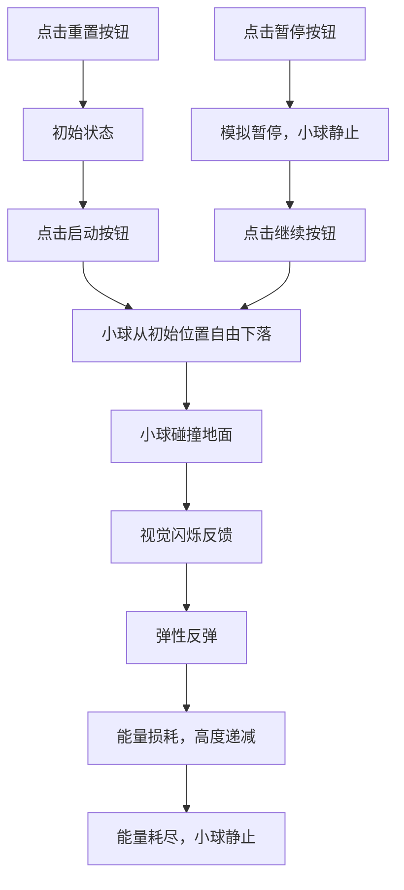

## 1. 产品概述

小球弹跳物理模拟器是一款面向基础物理教学的交互式Web应用，用于直观展示自由落体和弹性碰撞的物理原理。通过可视化的小球弹跳过程，帮助学生理解重力、弹性碰撞和能量损耗等核心物理概念。

- 主要用途：物理课堂教学辅助、学生自主学习和实验模拟
- 目标用户：中小学物理教师、学生及物理爱好者
- 产品价值：将抽象的物理公式转化为直观的动态演示，提升学习效率和趣味性

## 2. 核心功能

### 2.1 功能模块

1. **模拟主界面**：物理模拟区域、小球、地面
2. **控制面板**：启动按钮、重置按钮、暂停/继续按钮
3. **数据显示区**：弹跳次数统计、模拟时长统计
4. **碰撞反馈**：小球碰撞地面时的视觉闪烁效果

### 2.2 页面详情

| 页面名称 | 模块名称 | 功能描述 |
|---------|---------|---------|
| 主页面 | 模拟区域 | 固定大小的白色背景矩形区域，底部有固定地面 |
| 主页面 | 小球 | 固定大小和颜色的圆形小球，受重力影响自由下落 |
| 主页面 | 控制面板 | 三个功能按钮控制模拟流程 |
| 主页面 | 数据显示 | 实时显示弹跳次数和模拟时长 |

## 3. 核心流程

## 4. 用户界面设计

### 4.1 设计风格

- **主色调**：白色背景 (#FFFFFF)，强调简洁清晰
- **辅助色**：蓝色小球 (#3B82F6)，深灰色地面 (#374151)，绿色启动按钮 (#10B981)，红色重置按钮 (#EF4444)，黄色暂停按钮 (#F59E0B)
- **按钮样式**：圆角矩形按钮，带有轻微阴影，hover时有缩放效果
- **字体**：使用现代无衬线字体，清晰易读
- **布局风格**：居中布局，模拟区域居中显示，控制面板位于底部，数据显示位于顶部
- **图标风格**：简洁的文字按钮，无需复杂图标

### 4.2 页面设计概述

| 页面名称 | 模块名称 | UI元素 |
|---------|---------|--------|
| 主页面 | 模拟区域 | 800x500像素白色矩形区域，底部50像素高灰色地面 |
| 主页面 | 小球 | 直径40像素蓝色圆形，碰撞时闪烁白色 |
| 主页面 | 控制面板 | 三个按钮水平排列，间距均匀 |
| 主页面 | 数据显示 | 顶部居中显示弹跳次数和时长，字体清晰 |

### 4.3 响应性

- 采用固定尺寸设计，桌面端居中显示
- 确保在不同屏幕分辨率下居中对齐
- 按钮和文字大小保持一致，不随窗口缩放

