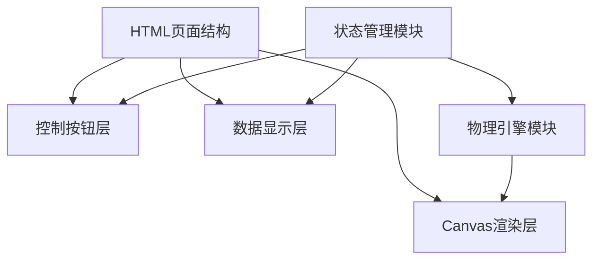

## 1. 架构设计



## 2. 技术描述

- **前端技术栈**：HTML5 + CSS3 + 原生JavaScript (ES6+)
- **渲染方式**：HTML5 Canvas 2D API
- **动画实现**：requestAnimationFrame 实现流畅动画
- **物理模拟**：自研轻量级物理引擎，实现重力、弹性碰撞计算
- **无需后端**：纯前端单页面应用，无服务器依赖

## 3. 模块划分

| 模块名称 | 功能描述 | 文件位置 |
|---------|---------|---------|
| 页面结构 | HTML基础结构，包含Canvas、按钮、数据显示区域 | index.html |
| 样式设计 | 页面布局、按钮样式、整体视觉效果 | css/style.css |
| 物理引擎 | 重力计算、碰撞检测、能量损耗、速度更新 | js/physics.js |
| 渲染模块 | Canvas绘制小球、地面、闪烁效果 | js/renderer.js |
| 控制模块 | 按钮事件处理、状态管理（运行/暂停/重置） | js/controller.js |
| 数据统计 | 弹跳次数计数、模拟时长计算 | js/stats.js |

## 4. 物理参数定义

### 4.1 固定物理参数（不可修改）

| 参数名称 | 数值 | 说明 |
|---------|------|------|
| 重力加速度 (g) | 980 | 像素/秒²，模拟真实重力 |
| 小球质量 (m) | 1 | 单位质量，简化计算 |
| 弹性系数 (e) | 0.7 | 碰撞能量保留比例（0-1） |
| 空气阻力 | 0.999 | 速度衰减系数 |
| 静止阈值 | 5 | 速度小于此值视为静止 |

### 4.2 界面尺寸参数

| 参数名称 | 数值 | 说明 |
|---------|------|------|
| 画布宽度 | 800 | 像素 |
| 画布高度 | 500 | 像素 |
| 地面高度 | 50 | 像素 |
| 小球半径 | 20 | 像素 |
| 初始X坐标 | 400 | 水平居中 |
| 初始Y坐标 | 80 | 距离顶部80像素 |

## 5. 核心算法

### 5.1 自由落体运动计算

```
v_y = v_y + g * dt
y = y + v_y * dt
```

### 5.2 弹性碰撞检测与响应

```
if (y + radius >= groundY):
    y = groundY - radius
    v_y = -v_y * elasticity
    bounce_count++
    trigger_flash()
```

### 5.3 能量耗尽判定

```
if (abs(v_y) < rest_threshold and y >= groundY - radius - 1):
    is_resting = true
    v_y = 0
```

