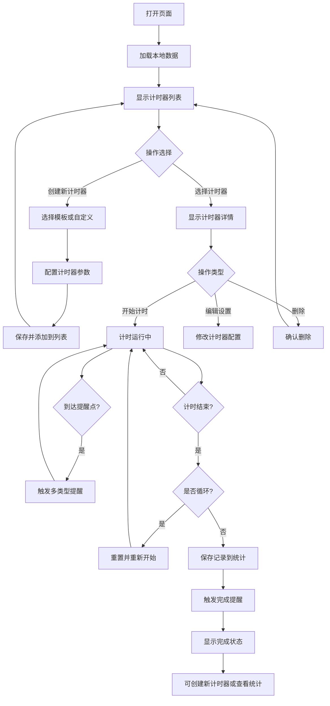

## 1. 产品概述

一款专业级多功能网页计时器，支持多计时器并行、循环计时、定时触发、毫秒级精度等进阶功能，配合全面的界面自定义和数据统计能力，适配专业工作、学习、健身、直播等多元化场景。

- 核心价值：从基础计时工具升级为专业计时管理平台，满足从个人到专业场景的全方位计时需求
- 目标用户：学生、自由职业者、健身教练、直播主、项目经理、厨房从业者等
- 市场价值：国内首款功能如此全面的纯前端网页计时器，无需安装即可使用

## 2. 核心功能（V2.0 升级版）

### 2.1 用户角色
| 角色 | 注册方式 | 核心权限 |
|------|----------|----------|
| 普通用户 | 无需注册 | 使用所有计时功能，本地保存个性化设置和数据 |

### 2.2 功能模块（新增）
7. **多计时器管理**：支持创建、编辑、删除多个并行计时器，标签页切换
8. **循环计时系统**：支持单次/循环模式，可设置循环次数或无限循环
9. **定时触发功能**：指定时间自动开始/结束计时
10. **毫秒级计时**：支持显示毫秒，满足高精度场景需求
11. **数据统计中心**：计时历史、使用时长统计、趋势图表
12. **数据导出**：支持导出CSV/JSON格式的计时记录
13. **多类型提醒**：视觉闪烁、音效、浏览器通知、语音播报
14. **高级界面自定义**：背景图片/颜色、多套皮肤、字体选择、透明度调节
15. **热键管理**：自定义全局快捷键，支持导入/导出配置
16. **网页嵌入**：生成iframe嵌入代码，支持自定义展示样式
17. **计时器模板**：预设常用场景模板（番茄工作法、健身HIIT、会议等）

### 2.3 页面详情（V2.0扩展）
| 页面名称 | 模块名称 | 功能描述 |
|---------|---------|---------|
| 主页面 | 多计时器标签页 | 支持同时运行多个计时器，标签页切换管理 |
| 主页面 | 计时器卡片 | 每个计时器独立显示：时间、进度、控制按钮、状态 |
| 主页面 | 添加计时器 | 快速创建新计时器，支持从模板选择 |
| 主页面 | 循环设置 | 循环次数、循环间隔、循环模式配置 |
| 主页面 | 定时设置 | 指定开始时间、结束时间，支持每日重复 |
| 主页面 | 毫秒显示切换 | 可开启/关闭毫秒级显示 |
| 设置页面 | 外观设置 | 背景图/色、皮肤主题、字体选择、透明度 |
| 设置页面 | 热键设置 | 全局快捷键自定义、预设方案、导入导出 |
| 设置页面 | 提醒设置 | 提醒类型、音效选择、音量、通知权限 |
| 统计页面 | 数据概览 | 总计时时长、完成次数、平均时长 |
| 统计页面 | 历史记录 | 详细计时历史列表，支持筛选搜索 |
| 统计页面 | 数据导出 | CSV/JSON格式导出，选择时间范围 |
| 嵌入页面 | 代码生成 | iframe代码生成，自定义显示选项 |

## 3. 核心流程（V2.0扩展）

## 4. 用户界面设计（V2.0升级）

### 4.1 设计风格
- **主色调**：扩展至6套主题（深邃蓝、活力橙、暗夜紫、清新绿、优雅粉、极简灰）
- **按钮风格**：支持多种按钮样式（圆角、直角、胶囊、3D效果）
- **字体**：内置8种精选字体，支持自定义字体
- **布局风格**：支持标签页模式和卡片网格模式切换
- **背景**：支持纯色、渐变、图片、视频背景
- **毛玻璃效果**：可调节的玻璃拟态效果

### 4.2 新增页面设计
| 页面名称 | 模块名称 | UI元素 |
|---------|---------|--------|
| 主页面 | 计时器标签栏 | 横向标签滚动、添加按钮、关闭按钮、激活状态指示 |
| 主页面 | 计时器网格 | 响应式卡片网格，每个卡片包含完整计时控制 |
| 设置页面 | 外观设置面板 | 背景选择器、主题色板、字体下拉、透明度滑块 |
| 设置页面 | 热键设置面板 | 快捷键列表、录制按钮、冲突检测、导入导出按钮 |
| 统计页面 | 数据图表 | 使用时长柱状图、完成率饼图、趋势折线图 |
| 统计页面 | 历史表格 | 可排序、筛选、分页的数据表格 |
| 嵌入页面 | 代码生成器 | 预览区域、选项配置、一键复制代码 |

### 4.3 响应式增强
- **桌面端**：多列网格布局，侧边栏设置面板
- **平板端**：双列或单列布局，底部标签栏
- **移动端**：单列堆叠，底部导航，手势操作支持
- **横屏适配**：特殊优化的横屏显示模式

### 4.4 动画升级
- 标签页切换的滑动过渡
- 计时器卡片的入场动画
- 数据统计的图表绘制动画
- 提醒时的粒子效果
- 背景切换的淡入淡出
- 数字滚动的平滑动画

## 5. 新增场景适配

### 5.1 番茄工作法
- 预设25分钟工作+5分钟休息循环
- 自动统计完成的番茄数
- 每日目标设置

### 5.2 健身训练
- HIIT间歇训练模板
- 动作名称自定义
- 组间休息计时

### 5.3 直播场景
- 直播倒计时显示
- 多阶段计时（开场、互动、结束）
- 大字体适合投屏

### 5.4 会议管理
- 议程多阶段计时
- 发言人时间限制
- 自动提醒切换
