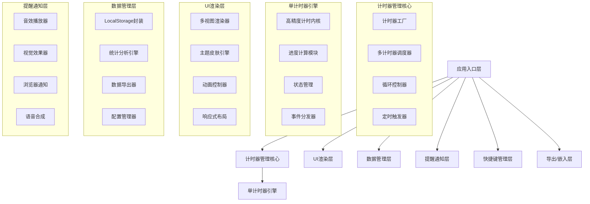

## 1. 架构设计（V2.0升级）



## 2. 技术描述（V2.0）

- **前端框架**: 原生 HTML5 + CSS3 + JavaScript (ES6+)
- **构建工具**: 无需构建工具，直接运行
- **样式方案**: CSS 变量 + CSS Grid/Flexbox + CSS 动画
- **数据存储**: LocalStorage (容量扩展至5MB)
- **音效方案**: Web Audio API + SpeechSynthesis API
- **图标方案**: 内联 SVG 图标库 (100+ 图标)
- **图表方案**: 原生 Canvas 绘制统计图表
- **通知方案**: Notification API + Page Visibility API
- **快捷键**: Keyboard API + 全局事件监听

## 3. 文件结构（V2.0扩展）

| 文件路径 | 用途 |
|---------|------|
| `/index.html` | 主页面，多视图容器 |
| `/css/style.css` | 主样式文件（含6套主题） |
| `/css/themes/*.css` | 各主题单独样式文件 |
| `/js/core/timer.js` | 高精度计时器核心类 |
| `/js/core/timerManager.js` | 多计时器管理器 |
| `/js/core/loopController.js` | 循环计时控制器 |
| `/js/core/scheduler.js` | 定时触发调度器 |
| `/js/ui/app.js` | 应用主控制器 |
| `/js/ui/timerView.js` | 计时器视图渲染 |
| `/js/ui/settingsView.js` | 设置面板视图 |
| `/js/ui/statsView.js` | 统计页面视图 |
| `/js/data/storage.js` | 本地存储管理 |
| `/js/data/statistics.js` | 统计数据分析 |
| `/js/data/exporter.js` | 数据导出模块 |
| `/js/notification/sound.js` | 音效管理 |
| `/js/notification/reminder.js` | 提醒管理 |
| `/js/notification/tts.js` | 语音合成模块 |
| `/js/utils/hotkeys.js` | 快捷键管理 |
| `/js/utils/validator.js` | 输入验证工具 |
| `/js/utils/embed.js` | 嵌入代码生成 |
| `/assets/icons/` | SVG 图标资源 |
| `/assets/sounds/` | 音效文件 |
| `/assets/backgrounds/` | 背景图片资源 |

## 4. 核心数据模型（V2.0扩展）

### 4.1 计时器配置
```javascript
{
  id: string,                           // 唯一标识
  name: string,                         // 计时器名称
  mode: 'countdown' | 'countup',        // 计时模式
  totalSeconds: number,                 // 总时长（秒）
  totalMilliseconds: number,            // 总毫秒数
  showMilliseconds: boolean,            // 是否显示毫秒
  
  loop: {
    enabled: boolean,                   // 是否启用循环
    count: number,                      // 循环次数（0表示无限）
    currentLoop: number,                // 当前循环次数
    interval: number,                   // 循环间隔（秒）
  },
  
  schedule: {
    enabled: boolean,                   // 是否启用定时
    startTime: string | null,           // 开始时间 'HH:mm'
    endTime: string | null,             // 结束时间 'HH:mm'
    repeatDays: number[],               // 重复日期 [0-6]
  },
  
  reminders: {
    early: number[],                    // 提前提醒点（秒）
    complete: {
      sound: boolean,
      visual: boolean,
      notification: boolean,
      speech: boolean,
    },
    everyMinute: boolean,               // 每分钟提醒
  },
  
  display: {
    fontSize: number,                   // 字体大小比例
    color: string | null,               // 自定义颜色
    showProgress: boolean,              // 显示进度条
  },
  
  createdAt: number,                    // 创建时间戳
  updatedAt: number,                    // 更新时间戳
}
```

### 4.2 计时器运行时状态
```javascript
{
  id: string,
  isRunning: boolean,
  isPaused: boolean,
  currentMilliseconds: number,          // 当前时间（毫秒）
  progress: number,                     // 进度 0-100
  startTime: number | null,             // 实际开始时间
  pauseTime: number | null,             // 暂停时间
  accumulatedPause: number,             // 累计暂停时长
  loopCount: number,                    // 已循环次数
  lastTick: number,                     // 上一次更新时间
}
```

### 4.3 全局设置
```javascript
{
  theme: string,                        // 当前主题
  background: {
    type: 'solid' | 'gradient' | 'image',
    value: string,
    opacity: number,
  },
  font: {
    family: string,
    size: number,
  },
  glassEffect: {
    enabled: boolean,
    blur: number,
    opacity: number,
  },
  hotkeys: {
    [action: string]: string,           // 快捷键映射
  },
  notification: {
    enabled: boolean,
    volume: number,
    soundFile: string,
  },
  viewMode: 'tabs' | 'grid',            // 显示模式
}
```

### 4.4 统计记录
```javascript
{
  id: string,
  timerId: string,
  timerName: string,
  mode: string,
  duration: number,                     // 实际计时时长（秒）
  targetDuration: number,               // 目标时长
  completed: boolean,                   // 是否完成
  startTime: number,
  endTime: number,
  loopCount: number,                    // 循环次数
  interrupted: boolean,                 // 是否被打断
}
```

### 4.5 热键配置
```javascript
{
  startPause: 'Space',
  reset: 'KeyR',
  skip: 'KeyS',
  addTimer: 'KeyN',
  nextTimer: 'Tab',
  prevTimer: 'Shift+Tab',
  toggleView: 'KeyV',
  toggleSettings: 'KeyO',
  toggleStats: 'KeyT',
  custom: [
    { key: string, action: string, timerId: string | 'all' }
  ]
}
```

## 5. 核心 API 设计（V2.0扩展）

### 5.1 Timer 类（增强版）
```javascript
class HighPrecisionTimer {
  constructor(config: TimerConfig)
  start(): void
  pause(): void
  resume(): void
  reset(): void
  skip(ms: number): void
  getTime(): { seconds: number, ms: number }
  getProgress(): number
  getState(): TimerState
  
  onTick(callback: (time: TimeObject) => void): void
  onComplete(callback: () => void): void
  onLoop(callback: (loopCount: number) => void): void
  onReminder(callback: (type: string) => void): void
  
  destroy(): void
}
```

### 5.2 TimerManager 类
```javascript
class TimerManager {
  static getInstance(): TimerManager
  createTimer(config: Partial<TimerConfig>): Timer
  deleteTimer(id: string): boolean
  getTimer(id: string): Timer | null
  getAllTimers(): Timer[]
  getRunningTimers(): Timer[]
  pauseAll(): void
  resumeAll(): void
  resetAll(): void
  
  onTimerAdded(callback: (timer: Timer) => void): void
  onTimerRemoved(callback: (id: string) => void): void
}
```

### 5.3 LoopController 类
```javascript
class LoopController {
  constructor(timer: Timer, config: LoopConfig)
  start(): void
  stop(): void
  getLoopCount(): number
  onLoopStart(callback: (count: number) => void): void
  onLoopComplete(callback: (count: number) => void): void
}
```

### 5.4 Scheduler 类
```javascript
class Scheduler {
  static checkSchedule(schedule: ScheduleConfig): boolean
  static getNextRunTime(schedule: ScheduleConfig): Date | null
  static isScheduledDay(days: number[]): boolean
}
```

### 5.5 Statistics 模块
```javascript
const Statistics = {
  addRecord(record: TimerRecord): void
  getRecords(filter?: FilterOptions): TimerRecord[]
  getSummary(): StatisticsSummary
  getDailyStats(days: number): DailyStats[]
  exportCSV(records: TimerRecord[]): string
  exportJSON(records: TimerRecord[]): string
}
```

### 5.6 HotkeyManager 类
```javascript
class HotkeyManager {
  constructor()
  register(key: string, action: () => void, context?: string): void
  unregister(key: string): void
  getRegistered(): Hotkey[]
  importConfig(config: HotkeyConfig): void
  exportConfig(): HotkeyConfig
  detectConflict(key: string): boolean
}
```

## 6. 性能优化策略

### 6.1 多计时器性能
- 使用 requestAnimationFrame 统一调度所有计时器更新
- 离屏计时器降低更新频率（1秒/次）
- 虚拟滚动优化大量计时器列表

### 6.2 内存管理
- 计时器销毁时清理所有事件监听
- 使用 WeakMap 存储临时数据
- 定期清理过期的统计数据

### 6.3 渲染优化
- CSS transform 替代 top/left 动画
- 使用 will-change 提示浏览器优化
- 批量 DOM 操作减少重排重绘

### 6.4 存储优化
- 统计数据分页存储
- 图片数据压缩存储（Base64 + 质量压缩）
- 定期清理超过1年的历史数据

## 7. 浏览器兼容性

| 功能 | Chrome | Firefox | Safari | Edge |
|------|--------|---------|--------|------|
| 基础功能 | 80+ | 75+ | 13+ | 80+ |
| 毫秒级计时 | 80+ | 75+ | 13+ | 80+ |
| 浏览器通知 | 80+ | 75+ | 13+ | 80+ |
| 语音合成 | 80+ | 75+ | 14+ | 80+ |
| 背景视频 | 80+ | 75+ | 14+ | 80+ |
| 剪贴板API | 80+ | 75+ | 13+ | 80+ |

## 8. 安全考虑

- 所有用户输入进行 XSS 过滤
- 存储数据进行大小限制
- 嵌入代码生成进行安全编码
- 快捷键不使用浏览器默认快捷键
- 通知请求在用户交互后触发
