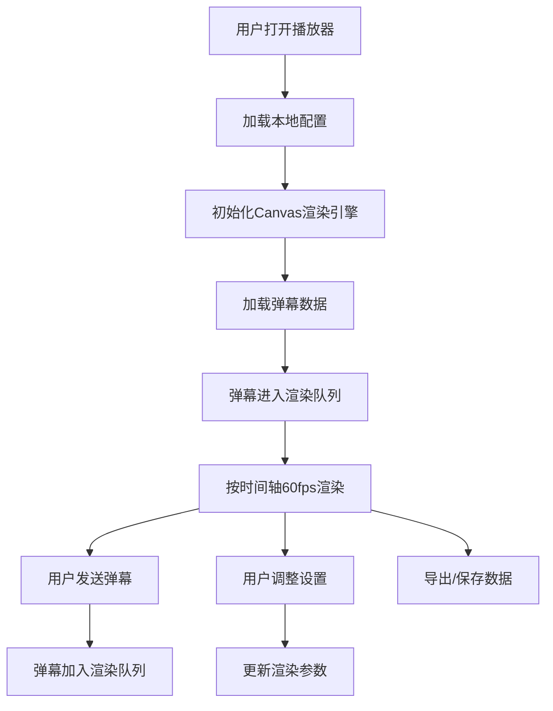

## 1. 产品概述
游戏弹幕播放器是一款高性能、功能丰富的弹幕播放系统，专为游戏直播和视频场景设计，支持多种弹幕类型、实时交互和深度自定义配置。
- 解决游戏场景下弹幕显示、互动和管理的核心需求，为玩家和观众提供沉浸式弹幕体验
- 支持60fps流畅渲染，兼容主流浏览器，提供API接口便于游戏集成

## 2. 核心功能

### 2.1 用户角色
| 角色 | 注册方式 | 核心权限 |
|------|----------|----------|
| 普通用户 | 无需注册 | 观看弹幕、发送弹幕、调整显示设置、导出弹幕数据 |
| 管理员 | 本地配置 | 屏蔽用户、管理弹幕、配置全局参数 |

### 2.2 功能模块
1. **播放器主界面**：视频/游戏画面显示区域、Canvas弹幕渲染层、控制面板
2. **弹幕发送模块**：文本输入、表情选择、颜色选择、弹幕类型切换
3. **弹幕控制模块**：显示/隐藏、密度调节、速度调节、用户屏蔽
4. **交互模块**：弹幕点击详情、点赞/举报、全屏模式、键盘快捷键
5. **数据管理模块**：JSON导入导出、历史记录、弹幕缓存
6. **设置模块**：样式自定义、区域配置、API管理、本地存储

### 2.3 页面详情
| 页面名称 | 模块名称 | 功能描述 |
|-----------|-------------|---------------------|
| 主播放器页面 | 弹幕渲染层 | Canvas/WebGL高性能渲染，支持滚动、顶部、底部、彩色、特效弹幕 |
| 主播放器页面 | 发送工具栏 | 文本输入框、表情面板、颜色选择器、弹幕类型下拉、发送按钮 |
| 主播放器页面 | 控制栏 | 播放/暂停、弹幕开关、密度滑块、速度滑块、全屏按钮、设置按钮 |
| 设置面板 | 显示设置 | 字体大小、透明度、显示区域、弹幕速度范围配置 |
| 设置面板 | 屏蔽管理 | 用户黑名单、关键词屏蔽、弹幕类型过滤 |
| 设置面板 | 数据管理 | 导入JSON、导出JSON、清空历史、缓存管理 |
| 弹幕详情弹窗 | 交互模块 | 显示发送者信息、点赞数、举报按钮、复制弹幕内容 |

## 3. 核心流程
用户打开播放器 → 加载历史弹幕/连接实时数据源 → 弹幕按时间轴渲染 → 用户发送弹幕 → 弹幕进入渲染队列 → 支持点击交互和设置调整 → 可导出弹幕数据或保存配置

## 4. 用户界面设计

### 4.1 设计风格
- **主色调**：深邃紫蓝渐变（#1a1a2e → #16213e），营造游戏科技感
- **强调色**：霓虹青（#00fff5）、电光粉（#ff006e）、荧光黄（#ffbe0b）
- **背景**：深色半透明毛玻璃效果，配合网格纹理
- **按钮风格**：圆角8px，悬停时发光效果，按下时微缩
- **字体**：主标题使用Orbitron（科技感），正文使用JetBrains Mono（清晰易读）
- **图标**：线性简约风格，支持hover动画

### 4.2 页面设计概述
| 页面名称 | 模块名称 | UI元素 |
|-----------|-------------|-------------|
| 主播放器页面 | 弹幕渲染层 | 全屏Canvas覆盖，z-index分层，支持透明度混合 |
| 主播放器页面 | 发送工具栏 | 底部固定、毛玻璃背景、渐变边框、输入框带发光效果 |
| 主播放器页面 | 控制栏 | 顶部/底部悬浮、半透明、图标按钮、滑块带渐变轨道 |
| 设置面板 | 侧边抽屉 | 从右侧滑入、毛玻璃、分区折叠、渐变分隔线 |
| 弹幕详情弹窗 | 居中模态框 | 模糊背景、圆角16px、发光边框、信息卡片布局 |

### 4.3 响应性
- **桌面端**：完整功能布局，控制栏可拖拽，设置面板侧边显示
- **平板端**：自适应缩放，工具栏紧凑排列
- **移动端**：简化控制栏，发送区改为底部弹出面板，优化触摸交互
- **全屏模式**：自动隐藏非核心UI，鼠标移动时短暂显示

### 4.4 动画与特效
- 弹幕入场：渐入+轻微缩放
- 弹幕出场：渐隐+淡出
- 按钮交互：hover时发光，点击时涟漪效果
- 面板切换：平滑过渡+模糊渐变
- 发送成功：弹幕向上飞出动画
