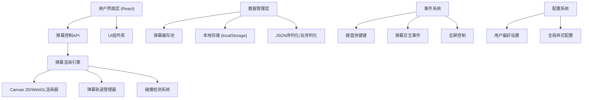

## 1. 架构设计



## 2. 技术描述

- **前端框架**: React@18 + TypeScript
- **构建工具**: Vite@5
- **样式方案**: TailwindCSS@3 + CSS Variables
- **渲染引擎**: Canvas 2D API (优先) / WebGL (备选高性能模式)
- **状态管理**: React Context + useReducer (轻量级方案)
- **图标**: Lucide React
- **动画**: CSS Transitions + requestAnimationFrame
- **本地存储**: localStorage + IndexedDB (大量弹幕缓存)

## 3. 目录结构

```
src/
├── components/          # UI组件
│   ├── Player/          # 播放器主组件
│   ├── Controls/        # 控制栏组件
│   ├── SendBar/         # 发送栏组件
│   ├── Settings/        # 设置面板
│   └── common/          # 通用组件
├── engine/              # 弹幕渲染引擎
│   ├── DanmakuEngine.ts # 主引擎类
│   ├── Renderer.ts      # Canvas渲染器
│   ├── TrackManager.ts  # 轨道管理
│   └── Pool.ts          # 对象池
├── types/               # TypeScript类型定义
│   └── danmaku.ts
├── hooks/               # 自定义Hooks
│   ├── useDanmaku.ts
│   ├── useFullscreen.ts
│   └── useKeyboard.ts
├── utils/               # 工具函数
│   ├── storage.ts
│   ├── json.ts
│   └── performance.ts
├── context/             # React Context
│   └── DanmakuContext.tsx
├── data/                # Mock数据
│   └── sample-danmaku.json
├── App.tsx
├── main.tsx
└── index.css
```

## 4. 核心数据结构

### 4.1 弹幕类型定义

```typescript
enum DanmakuType {
  SCROLL = 'scroll',       // 滚动弹幕
  TOP = 'top',             // 顶部固定
  BOTTOM = 'bottom',       // 底部固定
  COLOR = 'color',         // 彩色弹幕
  SPECIAL = 'special'      // 特殊效果
}

interface Danmaku {
  id: string;
  type: DanmakuType;
  content: string;
  color: string;
  fontSize: number;
  speed: number;
  opacity: number;
  userId: string;
  userName: string;
  timestamp: number;       // 发送时间戳
  playTime: number;        // 视频时间轴位置(ms)
  likes: number;
  isBlocked: boolean;
  effects?: DanmakuEffect;
}

interface DanmakuEffect {
  type: 'glow' | 'shake' | 'rainbow' | 'bounce';
  intensity: number;
}
```

### 4.2 配置类型定义

```typescript
interface PlayerConfig {
  display: {
    showDanmaku: boolean;
    opacity: number;
    fontSize: number;
    speedMultiplier: number;
    density: number;        // 0-1 弹幕密度
    area: number;           // 0-1 显示区域占比
    fontFamily: string;
  };
  filter: {
    blockedUsers: string[];
    blockedKeywords: string[];
    blockedTypes: DanmakuType[];
  };
  shortcut: {
    toggleDanmaku: string;
    toggleFullscreen: string;
    sendDanmaku: string;
  };
}
```

## 5. 核心API接口

### 5.1 弹幕引擎API

```typescript
interface IDanmakuEngine {
  // 生命周期
  init(canvas: HTMLCanvasElement): void;
  start(): void;
  pause(): void;
  stop(): void;
  destroy(): void;
  
  // 弹幕管理
  send(danmaku: Danmaku): void;
  batchSend(danmakus: Danmaku[]): void;
  clear(): void;
  
  // 控制
  setSpeed(multiplier: number): void;
  setOpacity(opacity: number): void;
  setFontSize(size: number): void;
  setDensity(density: number): void;
  toggleDisplay(show: boolean): void;
  
  // 交互
  hitTest(x: number, y: number): Danmaku | null;
  
  // 事件
  on(event: 'click' | 'hover' | 'send', callback: Function): void;
}
```

### 5.2 数据管理API

```typescript
interface IDataManager {
  importFromJSON(json: string): Danmaku[];
  exportToJSON(danmakus: Danmaku[]): string;
  saveToLocal(key: string, data: any): void;
  loadFromLocal(key: string): any;
  getHistory(startTime: number, endTime: number): Danmaku[];
}
```

## 6. 性能优化策略

### 6.1 渲染优化
- **对象池模式**: 复用弹幕对象，减少GC压力
- **离屏Canvas**: 预渲染复杂弹幕效果
- **分层渲染**: 不同类型弹幕使用不同Canvas层
- **视口裁剪**: 只渲染可见区域内的弹幕
- **帧率自适应**: 根据设备性能自动调整渲染质量

### 6.2 内存优化
- **弹幕缓存池**: LRU缓存策略，限制最大弹幕数
- **及时清理**: 移出屏幕的弹幕立即回收
- **离屏数据**: 大数据使用IndexedDB存储
- **引用管理**: 避免循环引用，防止内存泄漏

### 6.3 交互优化
- **事件委托**: 统一处理Canvas点击事件
- **节流防抖**: 高频操作（如滚动、resize）防抖处理
- **HitTest优化**: 空间分区碰撞检测

## 7. 浏览器兼容性

| 浏览器 | 最低版本 | 支持特性 |
|--------|----------|----------|
| Chrome | 90+ | 完全支持 |
| Firefox | 88+ | 完全支持 |
| Safari | 14+ | 完全支持 |
| Edge | 90+ | 完全支持 |

## 8. 路由定义

| 路由 | 页面 | 说明 |
|------|------|------|
| / | 播放器主页 | 包含弹幕播放器、控制栏、发送区 |
| /demo | Demo演示页 | 展示各种弹幕效果和功能 |
