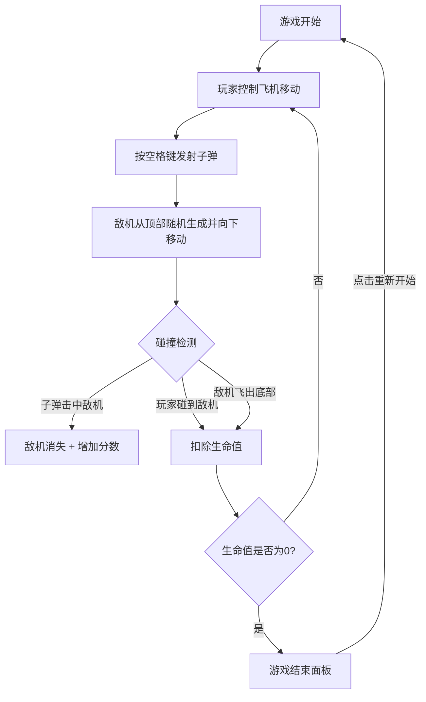

## 1. 产品概述

飞机大战射击游戏是一款经典的网页端射击类小游戏，玩家控制飞机躲避敌机并发射子弹消灭敌机获取分数。

- 主要用途：休闲娱乐，锻炼玩家反应能力和操作技巧
- 目标用户：喜欢休闲小游戏的各类人群
- 产品价值：提供简单易上手、有趣味性的网页游戏体验

## 2. 核心功能

### 2.1 功能模块

1. **游戏主界面**：游戏画布、玩家飞机、敌机、子弹、UI信息显示
2. **控制系统**：键盘控制飞机移动、空格键发射子弹
3. **碰撞检测**：子弹击中敌机、玩家碰撞敌机
4. **计分系统**：消灭敌机得分、实时显示分数
5. **生命系统**：玩家生命值管理、扣减逻辑
6. **游戏流程**：游戏开始、进行中、结束状态管理

### 2.2 页面详情

| 页面名称 | 模块名称 | 功能描述 |
|-----------|-------------|---------------------|
| 游戏主页面 | 游戏画布 | 渲染游戏场景，包含玩家飞机、敌机、子弹等所有游戏元素 |
| 游戏主页面 | 信息面板 | 右上角显示当前得分和剩余生命值 |
| 游戏主页面 | 游戏结束面板 | 生命值归零时弹出，显示最终得分和重新开始按钮 |

## 3. 核心流程

## 4. 用户界面设计

### 4.1 设计风格

- **主色调**：深蓝色 (#0a1628) 太空背景，营造空战氛围
- **强调色**：亮青色 (#00ffcc) 用于玩家飞机和UI边框
- **危险色**：红色 (#ff4444) 用于敌机和警告提示
- **字体**：使用 'Orbitron' 或类似的未来风格字体，增强科技感
- **按钮风格**：半透明背景 + 发光边框 + 悬停动画效果
- **布局**：全屏游戏画布，右上角信息面板，居中游戏结束弹窗

### 4.2 页面设计概述

| 页面名称 | 模块名称 | UI元素 |
|-----------|-------------|-------------|
| 游戏主页面 | 游戏画布 | 星空背景、玩家飞机（青色战斗机造型）、敌机（红色造型）、子弹（黄色光束）、爆炸粒子效果 |
| 游戏主页面 | 信息面板 | 半透明深色背景、发光边框、得分数字、生命值心形图标 |
| 游戏主页面 | 游戏结束面板 | 半透明黑色遮罩、白色标题文字、最终得分展示、"重新开始"按钮 |

### 4.3 响应性

- 桌面端优先设计，固定画布尺寸 800x600
- 画布居中显示，背景填充整个页面
- 支持键盘操作（方向键/WASD移动，空格发射）
