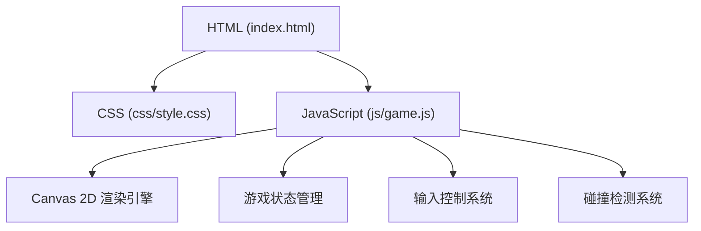
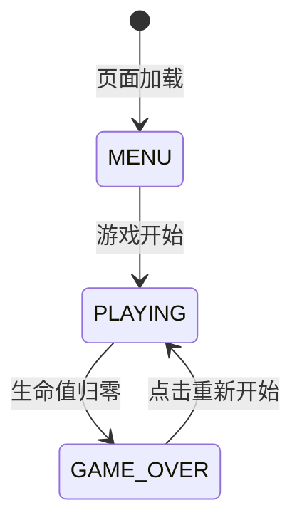

## 1. 架构设计



## 2. 技术描述

- **前端技术栈**：纯原生 HTML5 + CSS3 + JavaScript (ES6+)
- **渲染引擎**：HTML5 Canvas 2D API
- **项目结构**：
  - `index.html` - 游戏主页面
  - `css/style.css` - 样式文件
  - `js/game.js` - 游戏逻辑脚本
- **无需后端**，所有逻辑在浏览器端运行

## 3. 核心模块设计

### 3.1 游戏对象类

| 类名 | 属性 | 方法 | 描述 |
|------|------|------|------|
| Player | x, y, width, height, speed, lives | update(), draw(), shoot() | 玩家飞机 |
| Enemy | x, y, width, height, speed | update(), draw() | 敌方飞机 |
| Bullet | x, y, width, height, speed | update(), draw() | 子弹 |
| Particle | x, y, vx, vy, life, color | update(), draw() | 爆炸粒子效果 |

### 3.2 游戏常量

- 画布尺寸：800 x 600
- 玩家速度：5 像素/帧
- 子弹速度：8 像素/帧
- 敌机速度：2-4 像素/帧（随机）
- 子弹发射间隔：150ms
- 敌机生成间隔：1000ms
- 初始生命值：3
- 每消灭一个敌机得分：10

### 3.3 输入控制

- 方向键 ↑↓←→ 或 WASD：控制飞机移动
- 空格键：发射子弹（持续按住可连续发射）

## 4. 游戏流程



## 5. 目录结构

```
飞机游戏/
├── index.html      # 主页面
├── css/
│   └── style.css   # 样式文件
├── js/
│   └── game.js     # 游戏逻辑
└── .trae/
    └── documents/
        ├── prd.md
        └── tech-arch.md
```
