## 1. 产品概述

像素鸟飞行挑战是一款经典的休闲小游戏，玩家控制像素小鸟在管道间穿梭，考验反应能力和操作技巧。游戏简单易上手但富有挑战性，支持多种角色、道具、场景和对战模式，适合所有年龄段用户。

## 2. 核心功能

### 2.1 功能模块
1. **游戏主界面**：游戏画布、得分显示、最高分显示
2. **游戏控制**：点击屏幕/空格键控制小鸟飞行
3. **障碍物系统**：随机生成上下管道障碍，支持多种管道模式
4. **碰撞检测**：小鸟与管道、地面、天花板的碰撞判定
5. **计分系统**：穿越管道得分、最高分本地存储
6. **角色系统**：多种可选鸟类角色，不同颜色和外观
7. **道具系统**：无敌护盾、缩小道具、磁铁吸金币
8. **场景主题**：白天、夜晚、雪地、沙漠四种主题切换
9. **排行榜系统**：本地排行榜、每日挑战模式
10. **成就系统**：累计飞行距离、连续穿越等里程碑
11. **双人对战**：同屏上下分屏同时飞行比拼得分

### 2.3 页面详情
| 页面名称 | 模块名称 | 功能描述 |
|---------|---------|---------|
| 主菜单页面 | 角色选择 | 展示可选鸟类角色，点击切换 |
| 主菜单页面 | 主题选择 | 切换四种场景主题 |
| 主菜单页面 | 模式选择 | 单人模式/双人对战/每日挑战 |
| 主菜单页面 | 排行榜 | 展示本地最高分排名 |
| 主菜单页面 | 成就系统 | 展示已解锁/未解锁成就 |
| 游戏页面 | 游戏画布 | 渲染像素小鸟、管道、背景、地面 |
| 游戏页面 | 得分面板 | 实时显示当前得分和历史最高分 |
| 游戏页面 | 道具显示 | 显示当前激活的道具和剩余时间 |
| 游戏页面 | 开始/结束界面 | 游戏开始提示、游戏结束重玩选项 |
| 游戏页面 | 控制模块 | 监听鼠标点击和键盘空格键事件 |
| 双人对战页面 | 上下分屏 | 两个玩家各自的游戏区域 |
| 双人对战页面 | 玩家控制 | 玩家1用空格，玩家2用上箭头 |

## 3. 核心流程

```mermaid
flowchart LR
    A["游戏加载"] --> B["主菜单界面"]
    B --> C["选择角色/主题/模式"]
    C --> D["单人模式"]
    C --> E["双人对战"]
    C --> F["每日挑战"]
    D --> G["游戏开始"]
    E --> H["双人游戏开始"]
    F --> I["挑战开始"]
    G --> J["游戏进行中<br/>收集道具<br/>躲避管道"]
    J --> K{"碰撞"}
    K -->|是| L["游戏结束"]
    K -->|否| M{"获得道具"}
    M -->|护盾| N["无敌状态"]
    M -->|缩小| O["体积变小"]
    M -->|磁铁| P["吸附金币"]
    L --> Q["更新排行榜<br/>检查成就"]
    Q --> B
    H --> R["双人比拼<br/>各自得分"]
    R --> S{"任一玩家碰撞"}
    S -->|是| T["显示胜负"]
    T --> B
    I --> U["特定管道组合<br/>限时挑战"]
    U --> V{"时间结束或碰撞"}
    V --> W["获得挑战奖励"]
    W --> B
```

## 4. 用户界面设计

### 4.1 设计风格
- **主色调**：天蓝色背景 (#87CEEB)、绿色管道 (#228B22)、黄色小鸟 (#FFD700)
- **像素风格**：8-bit像素美术风格，清晰的像素边缘
- **字体**：像素风格等宽字体，大号数字显示得分
- **按钮风格**：像素化边框，悬停有轻微放大效果
- **角色多样性**：黄鸟、蓝鸟、红鸟、绿鸟、紫鸟、彩虹鸟
- **主题多样性**：每种主题有独立的配色方案

### 4.2 页面设计概述
| 页面名称 | 模块名称 | UI元素 |
|---------|---------|---------|
| 主菜单 | 角色选择区 | 横向滚动的小鸟卡片，选中高亮 |
| 主菜单 | 主题切换按钮 | 四个主题图标，点击切换预览 |
| 主菜单 | 模式选择按钮 | 单人/双人/挑战三个大按钮 |
| 主菜单 | 排行榜入口 | 奖杯图标，点击弹出排行榜 |
| 主菜单 | 成就入口 | 奖章图标，点击弹出成就列表 |
| 游戏页面 | 游戏区域 | 像素小鸟、滚动背景、像素管道、像素地面 |
| 游戏页面 | 道具栏 | 左上角显示已收集道具图标和时间 |
| 游戏页面 | 得分显示 | 顶部居中大号像素数字，白色带黑色描边 |
| 游戏页面 | 最高分 | 右上角小号像素文字显示 |
| 游戏页面 | 开始界面 | 中央显示"点击开始"提示文字 |
| 游戏页面 | 结束界面 | 显示游戏结束、最终得分、最高分、重新开始按钮 |
| 双人对战 | 上下分屏 | 上方玩家2，下方玩家1，中间分割线 |
| 双人对战 | 玩家标识 | 各自区域显示玩家编号 |

### 4.3 响应式设计
- 桌面端：固定画布尺寸，支持鼠标点击和键盘操作
- 移动端：自适应屏幕宽度，支持触摸操作
- 游戏区域保持固定宽高比，居中显示
- 双人模式在移动端自动调整布局

### 4.4 新增元素设计
#### 鸟类角色
| 角色名称 | 颜色 | 解锁条件 |
|---------|------|---------|
| 小黄鸟 | 金黄色 | 默认解锁 |
| 小蓝鸟 | 天蓝色 | 累计得分100 |
| 小红鸟 | 火红色 | 累计得分500 |
| 小绿鸟 | 翠绿色 | 连续穿越20根管道 |
| 紫罗鸟 | 紫罗兰 | 累计飞行10分钟 |
| 彩虹鸟 | 七彩渐变 | 解锁所有成就 |

#### 道具类型
| 道具名称 | 图标 | 效果 | 持续时间 |
|---------|------|------|---------|
| 无敌护盾 | 🛡️ | 免疫管道碰撞 | 5秒 |
| 缩小药水 | 🔮 | 小鸟体积缩小50% | 8秒 |
| 磁铁 | 🧲 | 自动吸附附近金币 | 10秒 |

#### 管道模式
| 模式名称 | 描述 | 出现条件 |
|---------|------|---------|
| 普通管道 | 固定位置的上下管道 | 默认 |
| 移动管道 | 上下管道缓慢移动 | 得分>10后随机出现 |
| 旋转管道 | 管道开口旋转变化 | 得分>20后随机出现 |
| 消失管道 | 管道会短暂消失 | 得分>30后随机出现 |

#### 场景主题
| 主题名称 | 天空色 | 地面色 | 管道色 |
|---------|-------|-------|-------|
| 白天 | 天蓝色渐变 | 黄绿色草地 | 绿色 |
| 夜晚 | 深蓝色星空 | 深紫色地面 | 银灰色 |
| 雪地 | 冰蓝色渐变 | 白色雪地 | 深绿色 |
| 沙漠 | 橙黄色渐变 | 沙黄色 | 棕褐色 |
