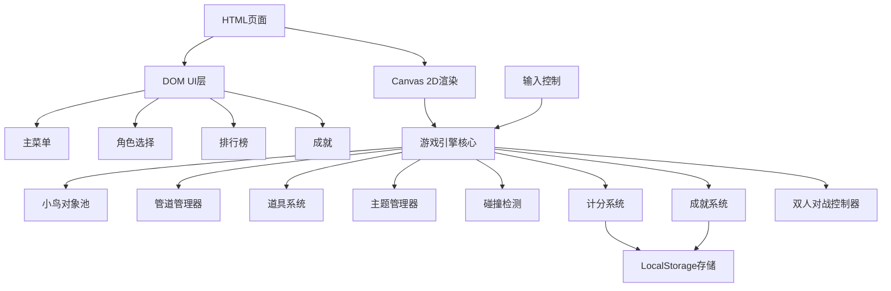

## 1. 架构设计



## 2. 技术描述

- **前端**：原生 HTML5 + Canvas 2D + JavaScript (ES6+)
- **构建工具**：无需构建，直接运行
- **样式**：原生 CSS3，像素风格样式
- **数据存储**：LocalStorage 存储最高分、排行榜、成就、解锁角色
- **动画**：requestAnimationFrame 实现60fps流畅动画

## 3. 目录结构

```
像素鸟飞行挑战/
├── index.html          # 游戏主页面
├── style.css           # 游戏样式
├── game.js             # 游戏核心逻辑
└── .trae/
    └── documents/
        ├── PRD.md
        └── TechnicalArchitecture.md
```

## 4. 核心模块说明

### 4.1 游戏主循环
- 使用 requestAnimationFrame 实现游戏循环
- 固定时间步长更新游戏状态
- 分离更新逻辑与渲染逻辑
- 支持暂停和恢复

### 4.2 小鸟对象
- 属性：x, y坐标、速度、加速度、旋转角度、角色类型、道具状态
- 方法：flap() 拍翅、update() 更新位置、draw() 渲染、applyPowerUp() 应用道具
- 对象池支持多只小鸟（双人模式）

### 4.3 角色系统
- 6种可解锁鸟类角色
- 每种角色有独特的颜色和视觉效果
- 解锁条件存储在LocalStorage
- 彩虹鸟有特殊的渐变渲染效果

### 4.4 道具系统
- 道具类型：护盾、缩小、磁铁
- 道具有持续时间，时间结束自动失效
- 道具随机生成，小鸟触碰即可获得
- 同一时间可激活多个道具

### 4.5 管道系统
- 4种管道模式：普通、移动、旋转、消失
- 管道对数组管理，支持循环复用
- 随机生成管道间距和位置
- 根据得分动态增加难度
- 移动管道有速度和方向属性
- 消失管道有可见/隐藏周期

### 4.6 主题系统
- 4种场景主题：白天、夜晚、雪地、沙漠
- 每种主题有独立的配色方案
- 夜晚主题有星星背景
- 雪地主题有雪花粒子效果

### 4.7 碰撞检测
- AABB 碰撞检测算法
- 检测小鸟与管道、地面、天花板、道具的碰撞
- 护盾状态下免疫管道碰撞
- 缩小状态下碰撞体积减小

### 4.8 计分系统
- 穿越管道时得分+1
- 连续穿越有额外奖励
- LocalStorage 持久化最高分
- 排行榜存储前10名成绩

### 4.9 成就系统
- 多种成就类型：得分、连续穿越、飞行时间、收集道具
- 成就状态持久化存储
- 新成就解锁时有提示动画

### 4.10 双人对战模式
- 上下分屏，两个独立的游戏区域
- 玩家1：空格键控制
- 玩家2：上箭头键控制
- 各自计分，先碰撞者输
- 显示胜负结果

## 5. 数据存储结构

### 5.1 LocalStorage 键值
- `pixelBirdBestScore`: 最高分
- `pixelBirdLeaderboard`: 排行榜数组
- `pixelBirdUnlockedBirds`: 已解锁角色数组
- `pixelBirdSelectedBird`: 当前选中角色
- `pixelBirdSelectedTheme`: 当前选中主题
- `pixelBirdAchievements`: 成就状态对象
- `pixelBirdTotalScore`: 累计得分
- `pixelBirdTotalPlayTime`: 累计游戏时间（秒）
- `pixelBirdMaxConsecutive`: 最大连续穿越数
- `pixelBirdDailyChallenge`: 每日挑战数据

## 6. 性能优化
- 对象池模式复用管道和道具对象，减少GC
- 离屏画布预渲染静态元素
- 限制最大同时存在的管道数量
- 粒子系统对象池
